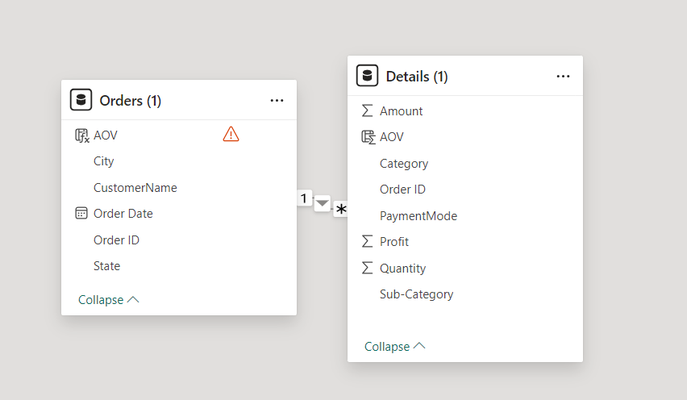

# E-commerce Sales Dashboard

## Overview
This Power BI dashboard provides an overview of e-commerce sales performance, including key metrics such as profit, quantity sold, and sales amount. It offers insights into sales trends, category performance, payment modes, and geographic distribution of sales.

## Metrics Included
- **Profit by Month**: Displays monthly profit trends.
- **Sum of Profit by Sub-Category**: Shows profit distribution across different product sub-categories.
- **Sum of Quantity by Category**: Represents the total quantity sold for each product category.
- **Sum of Quantity by Payment Mode**: Illustrates the quantity of items sold through different payment methods.
- **Sum of Amount by State**: Highlights the total sales amount for each state.
- **Indicators**:
  - **Sum of Amount**: Total sales amount.
  - **Sum of Quantity**: Total quantity of items sold.
  - **Sum of Profit**: Total profit earned.
  - **Sum of AOV (Average Order Value)**: Average value of each order.

